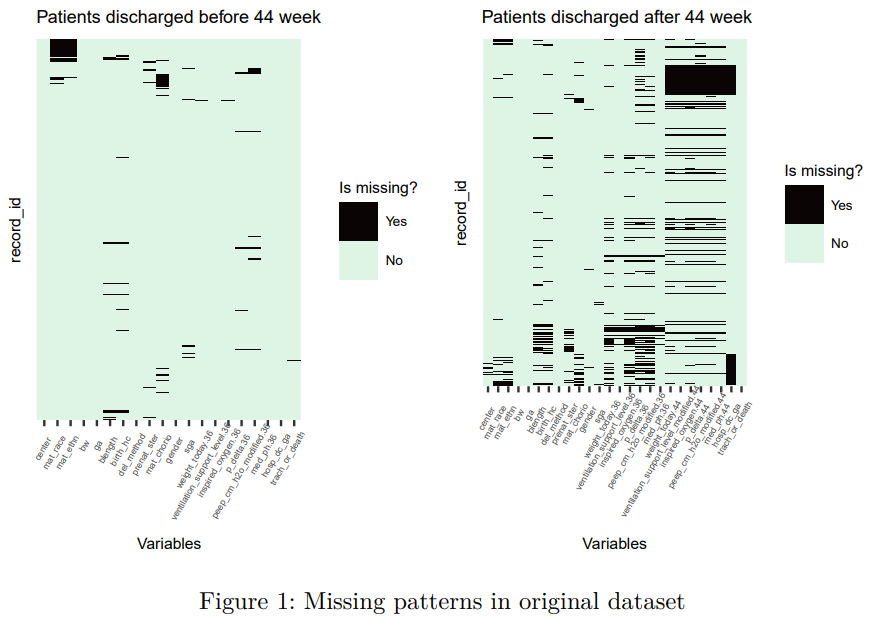
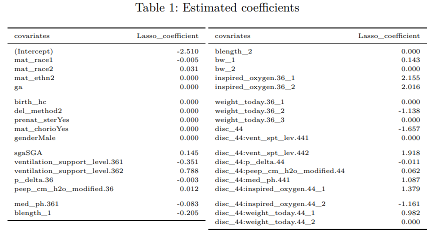
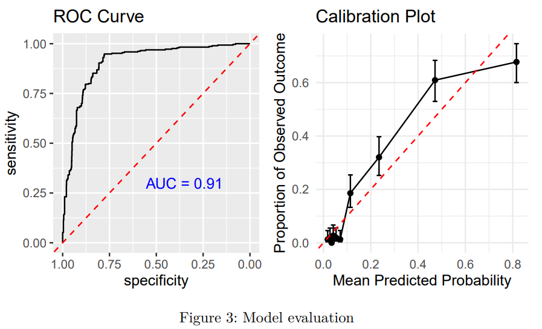

# Predicting Tracheostomy/Death in Neonates with Severe BPD: a comprehensive mix-effect logistic regression model accounting for patients with different discharge age

## Description

This project is focused on the development of a regression model to predict the composite outcome of tracheostomy or death in neonates with severe bronchopulmonary dysplasia (sBPD). The timing and criteria for tracheostomy placement in this patient population are subjects of ongoing debate within the medical community. Accurate prediction of the need for tracheostomy at early postmenstrual ages (PMA) is of paramount importance, as it can significantly impact clinical decision-making and counseling for families.

We utilized a national dataset containing demographic, diagnostic, and respiratory parameters of infants with sBPD. The project involves thorough data preprocessing to handle missing data and account for variations introduced by data collected from multiple medical centers. We employ regression modeling to predict the composite outcome of tracheostomy placement or death, offering insights into when and for whom tracheostomy may be necessary.

## Repository Structure
`./Figures_and_tables`: the folder that contains the generated figures and plots from the analysis.
`report2.qmd`:  Source code for report.pdf
`cite.bib`: bibliography embedded in the report.
`report.pdf`: Final report of the project
`README.md`: This README file

## Report layout
**Introduction**: Contextualizes the need for predictive modeling in neonates with sBPD and defines the study's objectives.

**Methods:** Describes the analytical approach, including data preprocessing, multiple imputation strategies, and the application of lasso logistic regression for model development.

**Results:** Presents the outcomes of the predictive modeling, highlighting the performance metrics and key predictors identified.

**Discussion:** Reflects on the strengths and limitations of the analytical methods, the implications of the findings, and potential areas for future research.

**Appendices:** Contains supplementary material supporting the analysis.

## Figures and tables

Figure 1: Missing patterns in the original dataset.

Table: Estimated coefficients in the final model

Figure 2: Model discrimination and calibration.

## Getting Started

To use this project, follow these steps:

1. Clone the project repository to your local machine.

2. Open the project in RStudio (or your preferred R development environment).

3. Follow the provided RMarkdown report to understand the analysis, methods, and findings.

4. You can explore and modify the R code to adapt the model and analysis to your specific requirements.

### Prerequisites

Before you begin, ensure you have the following software/tools installed:

- RStudio (or another R development environment)
- R packages required for the analysis (as specified in the RMarkdown report)

Feel free to contribute to the project, report issues, or make improvements.

## Acknowledgments

Dr. Chris Schmid from the Biostatistics Department at Brown University for the partnership.

Participating centers in the BPD Collaborative Registry for providing data.

